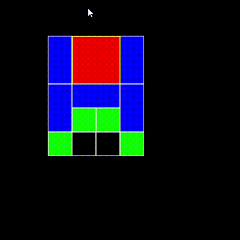

# Klotski
Klotski is a puzzle where a certain configuration is needed to be reached in order to win the game. This is a python implementation where one can play the game or make the computer solve it for you! In order to Win the Red Large Box must be put into the lowest row middle position. The program Uses **Breadth First Search** to Efficiently find the Quickest Solution from the current configuration. Once you are tired of playing click the window and **press the 'A' key** after a little while the program will begin to solve itself.
## Example of the Game Solving Itself

## Running and Installation

Must have pygame installed 

Simply Run Klotski.py

